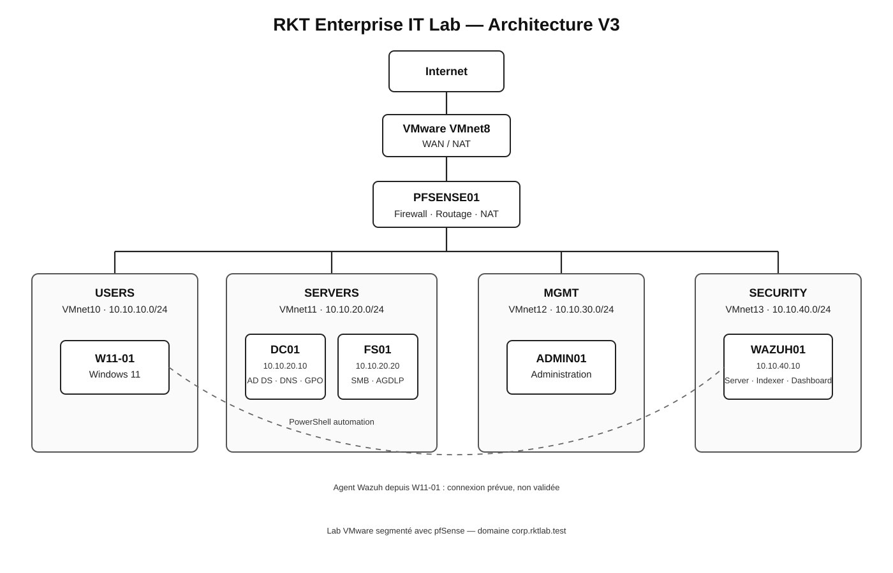

# RKT Enterprise IT Lab

Projet personnel fait pendant mon DEC en Techniques de l'informatique, profil Réseaux et sécurité.

Le lab couvre le réseau, Windows Server, Active Directory, PowerShell, le support TI et la sécurité.

## Architecture

### Réseaux

| Zone | Réseau | Passerelle | Usage |
|---|---|---|---|
| USERS | 10.10.10.0/24 | 10.10.10.1 | postes utilisateurs |
| SERVERS | 10.10.20.0/24 | 10.10.20.1 | serveurs |
| MGMT | 10.10.30.0/24 | 10.10.30.1 | administration |
| SECURITY | 10.10.40.0/24 | 10.10.40.1 | sécurité |

Les réseaux sont en VMware host-only. pfSense gère le routage, le pare-feu et le NAT.

### Machines

| Machine | Rôle |
|---|---|
| PFSENSE01 | pare-feu, routage et NAT |
| DC01 | Active Directory et DNS |
| FS01 | partages SMB |
| W11-01 | poste utilisateur Windows 11 |
| ADMIN01 | poste d'administration |
| UBUNTU01 | pratique Linux |
| WAZUH01 | serveur Wazuh sur Ubuntu 24.04 LTS |

## Parcours du lab

| Étape | Sujet | État |
|---|---|---|
| [Day 01](docs/day01-virtualization-foundations.md) | VMware et réseaux virtuels | fait |
| [Day 02](docs/day02-tcpip-foundations.md) | TCP/IP et Wireshark | fait |
| [Day 03](docs/day03-pfsense-segmentation.md) | pfSense, NAT et segmentation | fait |
| [Day 04](docs/day04-active-directory-foundation.md) | Active Directory et DNS | fait |
| [Day 05](docs/day05-ad-gpo-file-services.md) | GPO, SMB, AGDLP et LAPS | fait |
| [Day 06](docs/day06-powershell-automation.md) | PowerShell | fait |
| [Day 07](docs/day07-windows-endpoint-sysinternals.md) | Windows, Sysinternals et Jira | fait |
| [Day 08](docs/day08-entra-intune-autopilot.md) | Entra ID, Intune et Autopilot | étude |
| [Day 09](docs/day09-fortinet-linux-vpn.md) | Fortinet, Linux et VPN | étude + pratique Linux |
| [Day 10](docs/day10-wazuh-sysmon-incident-response.md) | Wazuh, Sysmon et réponse aux incidents | partiel |
| [Day 11](docs/day11-enterprise-operations.md) | tickets, escalade, change management et ITGC | fait |

## Ce que j'ai fait

### Réseau

IPv4, ARP, ICMP, DNS, TCP, routage, NAT, règles pfSense et dépannage entre plusieurs réseaux.

### Windows Server et Active Directory

Domaine corp.rktlab.test, OU, utilisateurs, groupes, DNS, GPO, partages SMB, AGDLP et Windows LAPS.

### PowerShell

Quatre scripts dans [scripts](scripts/) : création d'utilisateurs AD, désactivation d'un compte, inventaire Windows et tests réseau.

### Support TI

Dépannage Windows avec Sysinternals, tickets Jira et base de connaissances. Le Day 11 ajoute 12 incidents, cinq traitements et deux escalades.

### Sécurité

WAZUH01 est installé et le dashboard fonctionne. La connexion de W11-01 comme agent n'a pas été terminée.

## Travaux de cours

Mes rapports de cours sont classés par domaine et reliés aux compétences utilisées.

[Voir les travaux académiques](academic-work/README.md)

## Fichiers principaux

- [Architecture finale](diagrams/architecture-v3-final.svg)
- [Compétences et preuves](docs/job-requirements-evidence.md)
- [Day 05 — GPO, services de fichiers et permissions](docs/day05-ad-gpo-file-services.md)
- [Test-RKTNetwork.ps1](scripts/Test-RKTNetwork.ps1)
- [Day 07 — Windows, Sysinternals et support TI](docs/day07-windows-endpoint-sysinternals.md)
- [Day 10 — Dépannage Wazuh](troubleshooting/day10-wazuh-connectivity.md)
- [Day 11 — Opérations TI](docs/day11-enterprise-operations.md)
- [Travaux académiques](academic-work/README.md)

## À noter

- Day 08 : Entra ID, Intune et Autopilot étudiés sans tenant complet.
- Day 09 : FortiGate et VPN étudiés; Linux pratiqué en VM.
- Day 10 : serveur et dashboard Wazuh fonctionnels; agent Windows à reprendre.
