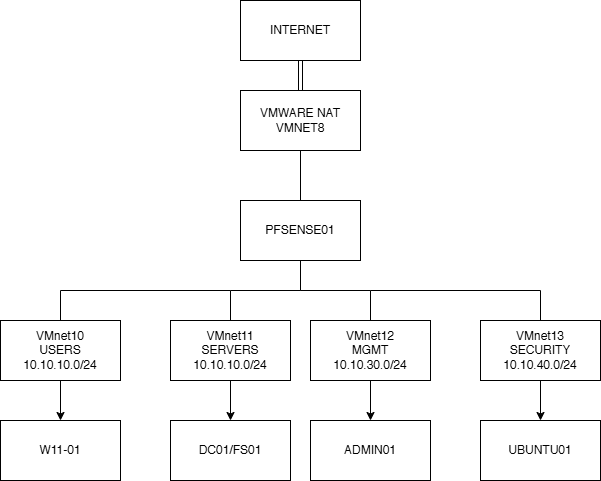

# Day 01 — Monter la base du lab

La première étape a été de préparer VMware Workstation Pro et de poser une structure assez propre pour pouvoir ajouter les services ensuite sans tout refaire.

## Machines préparées

J'ai créé les VMs suivantes :

- `PFSENSE01`
- `DC01`
- `FS01`
- `W11-01`
- `ADMIN01`
- `UBUNTU01`

Les ressources CPU, RAM et disque ont été ajustées selon le rôle de chaque VM pour éviter de surcharger le PC hôte.

## Réseaux VMware

| Zone | Réseau |
|---|---|
| USERS | `10.10.10.0/24` |
| SERVERS | `10.10.20.0/24` |
| MGMT | `10.10.30.0/24` |
| SECURITY | `10.10.40.0/24` |

J'ai utilisé des réseaux host-only pour garder les zones internes séparées dans VMware. La sortie Internet passe ensuite par pfSense et son interface WAN.

## Notions que j'ai dû maîtriser

VM, hyperviseur de type 2, vCPU, mémoire virtuelle, disque virtuel, snapshot, clone, NAT, host-only, carte réseau virtuelle et commutateur virtuel.

Je ne voulais pas seulement connaître les définitions : le but était surtout de comprendre ce que chaque choix change dans le fonctionnement du lab.

## Première architecture

Cette version sert de point de départ. L'architecture est ensuite devenue plus précise avec la segmentation pfSense du Day 03.

## À retenir

Le plus important sur cette étape a été de bien séparer les réseaux dès le début. Une mauvaise base VMware aurait rendu les Days suivants beaucoup plus difficiles à dépanner.
