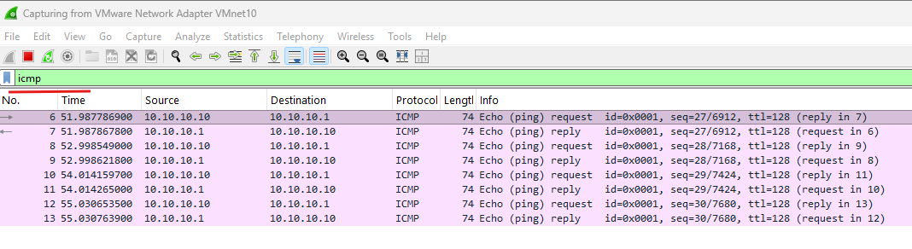
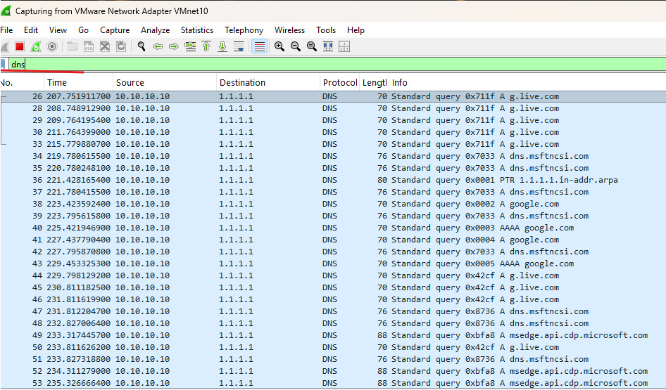
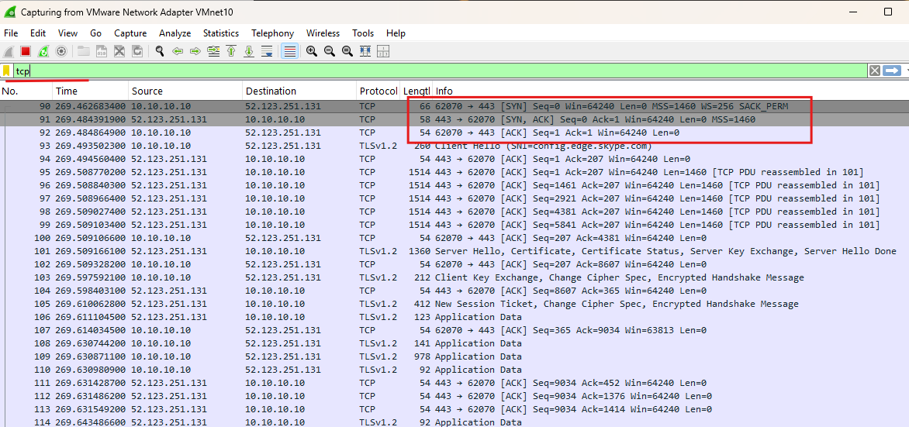

# Day 02 — Fondements TCP/IP et analyse Wireshark

## Objectif

Valider les bases TCP/IP du laboratoire et observer le fonctionnement de plusieurs protocoles avec Wireshark.

## Configuration de test

Pour les premiers tests réseau de `W11-01` :

| Paramètre | Valeur |
|---|---|
| Adresse IPv4 | `10.10.10.10` |
| Masque | `255.255.255.0` |
| Passerelle | `10.10.10.1` |
| DNS de test | `1.1.1.1` / `8.8.8.8` |

> Cette configuration correspond aux tests de base du Day 02. Après le déploiement d'Active Directory au Day 04, les postes du domaine utilisent `DC01` (`10.10.20.10`) comme serveur DNS.

## Vérifications réalisées

```powershell
ipconfig /all
ping 10.10.10.1
ping 1.1.1.1
nslookup google.com
route print
arp -a
```

Ces commandes permettent de vérifier l'adresse IP, la passerelle, le routage, la résolution DNS et le cache ARP.

## Analyse Wireshark

### ICMP

Le trafic ICMP a été observé pendant un `ping` afin d'identifier les requêtes et réponses Echo.



### DNS

Une requête DNS a été capturée afin d'observer la résolution d'un nom en adresse IP.



### TCP

Une connexion TCP a été observée afin d'identifier le three-way handshake : **SYN → SYN-ACK → ACK**.



## Notions validées

- adressage IPv4
- masque de sous-réseau
- passerelle par défaut
- ARP
- ICMP
- DNS
- TCP
- différence entre connectivité IP et résolution de noms

## Dépannage

Cinq problèmes ont été volontairement reproduits :

1. mauvaise passerelle
2. mauvais masque
3. mauvais serveur DNS
4. adresse IP dupliquée
5. carte réseau désactivée

Voir [Day 02 — Dépannage réseau](../troubleshooting/day02-break-fix.md).

## Ce que j'ai appris

Cette étape m'a permis de relier les commandes Windows aux paquets réellement observés sur le réseau et de suivre un ordre de diagnostic simple avant de modifier une configuration.
