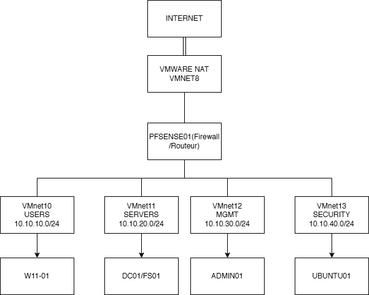
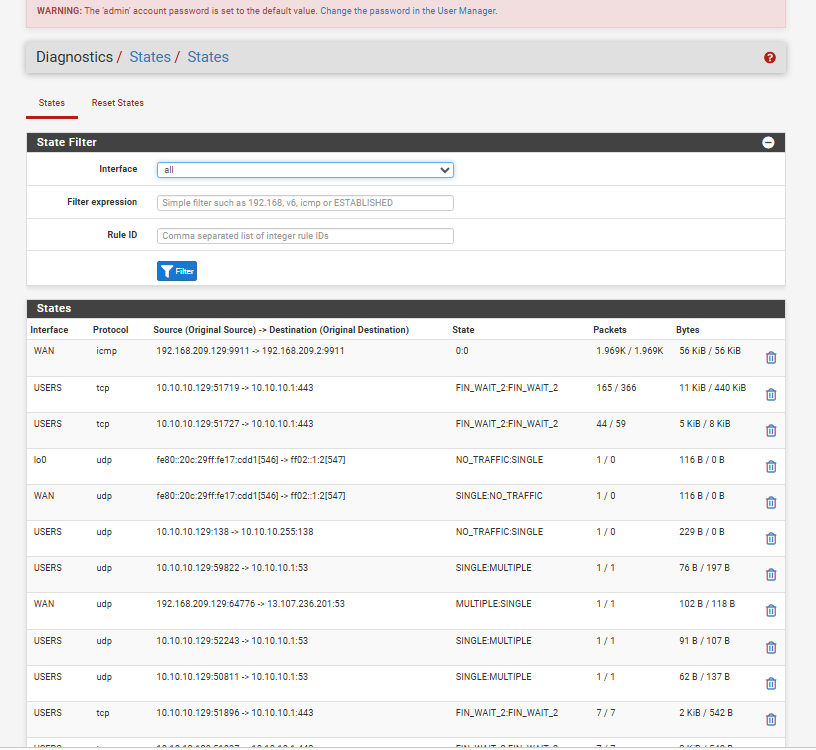
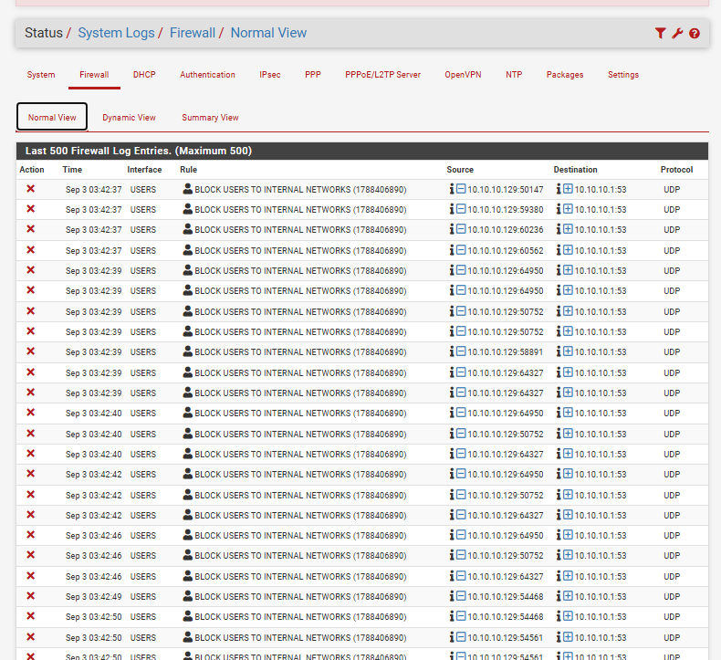
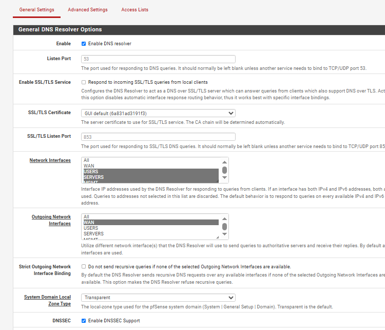

# Day 03 — pfSense et segmentation

Après les tests TCP/IP, j'ai utilisé pfSense comme point central entre les différents réseaux du lab.



## Les quatre zones

| Zone | Réseau | Passerelle |
|---|---|---|
| USERS | `10.10.10.0/24` | `10.10.10.1` |
| SERVERS | `10.10.20.0/24` | `10.10.20.1` |
| MGMT | `10.10.30.0/24` | `10.10.30.1` |
| SECURITY | `10.10.40.0/24` | `10.10.40.1` |

Ce sont des réseaux VMware host-only. pfSense assure le routage entre eux et le NAT vers Internet.

## Ce que j'ai configuré

- interfaces pour les quatre zones internes et le WAN
- routage inter-réseaux
- NAT sortant automatique
- règles de pare-feu par interface
- DHCP sur USERS pendant les premiers tests
- DNS Resolver avant l'arrivée d'Active Directory

À partir du Day 04, `DC01` devient le DNS principal des postes du domaine.

## Logique de filtrage

Je voulais éviter un simple « allow any ». Les postes USERS peuvent sortir vers Internet et joindre les services nécessaires sur SERVERS, mais l'accès vers MGMT reste bloqué. Le réseau MGMT garde les accès d'administration nécessaires.

La règle que je garde en tête : **une route indique où envoyer le trafic; une règle de pare-feu décide s'il a le droit de passer.**

## Validation







Quelques tests utilisés :

```powershell
ping 10.10.10.1
Test-NetConnection 10.10.20.10 -Port 53
Test-NetConnection 10.10.20.20 -Port 445
```

## Ce que j'ai cassé pour tester

J'ai reproduit un mauvais DNS, une règle de pare-feu désactivée, un NAT sortant désactivé et une mauvaise passerelle. Les vérifications sont détaillées dans [Day 03 — Dépannage pfSense](../troubleshooting/day03-pfsense-break-fix.md).

## Bilan

Cette étape est devenue la base réseau du reste du projet. Elle m'a surtout appris à séparer routage, filtrage, NAT et DNS au lieu de traiter « le réseau » comme un seul problème.
