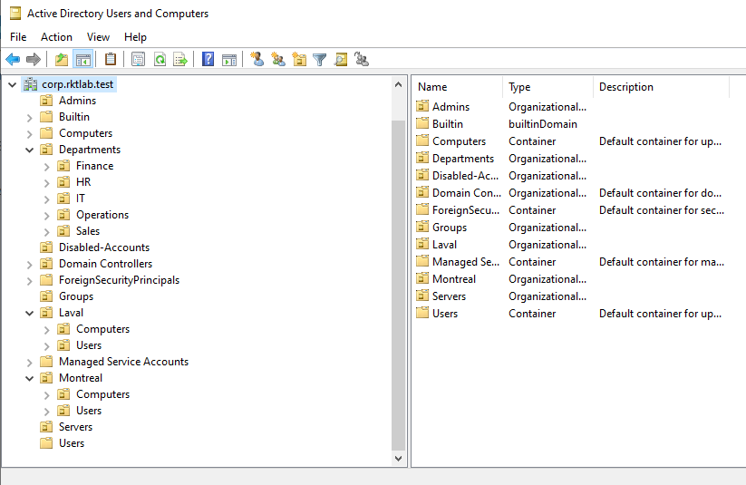
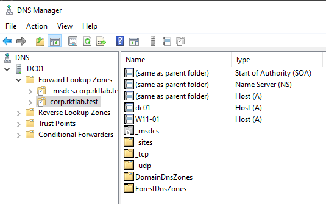
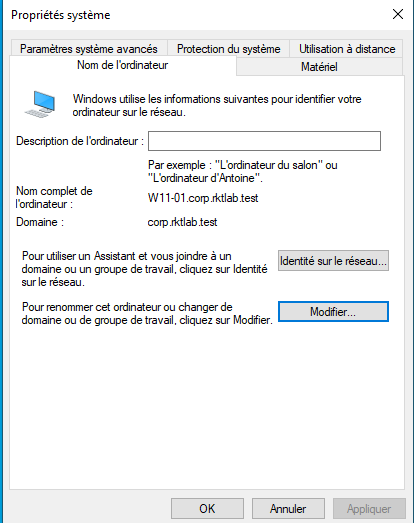

# Day 04 — Active Directory et DNS

## Objectif

Déployer Active Directory Domain Services et DNS sur `DC01`, créer la structure du domaine et joindre `W11-01` au domaine.

## Configuration de DC01

| Paramètre | Valeur |
|---|---|
| Nom | `DC01` |
| Adresse IP | `10.10.20.10` |
| Masque | `255.255.255.0` |
| Passerelle | `10.10.20.1` |
| DNS | `10.10.20.10` |

Rôles installés :

- Active Directory Domain Services
- DNS Server

## Domaine Active Directory

```text
corp.rktlab.test
```

## Organisation des OU

La structure comprend notamment :

```text
corp.rktlab.test
├── Montreal
│   ├── Users
│   └── Computers
├── Laval
│   ├── Users
│   └── Computers
├── Departments
│   ├── Finance
│   ├── HR
│   ├── IT
│   ├── Sales
│   └── Operations
├── Groups
├── Servers
├── Admins
└── Disabled-Accounts
```

Les OU de départements sont utilisées pour les comptes créés par l'automatisation PowerShell. Les OU de sites servent notamment à organiser les postes et à cibler certaines GPO.

## DNS des postes du domaine

Après le déploiement d'Active Directory, les postes membres du domaine utilisent `DC01` comme serveur DNS principal :

```text
10.10.20.10
```

Cela permet de résoudre les enregistrements nécessaires à Active Directory.

## Validation de DC01

```powershell
Get-ADDomain
Get-Service DNS,Netlogon,KDC,ADWS
```

Les services nécessaires au domaine ont été vérifiés après l'installation.

## Preuves







## Résultat

- domaine `corp.rktlab.test` créé
- AD DS et DNS fonctionnels
- structure d'OU créée
- `W11-01` joint au domaine
- résolution DNS interne validée

## Ce que j'ai appris

Cette étape m'a permis de comprendre le rôle du DNS dans Active Directory, la différence entre les OU et les groupes, et les éléments nécessaires pour joindre correctement un poste Windows à un domaine.
