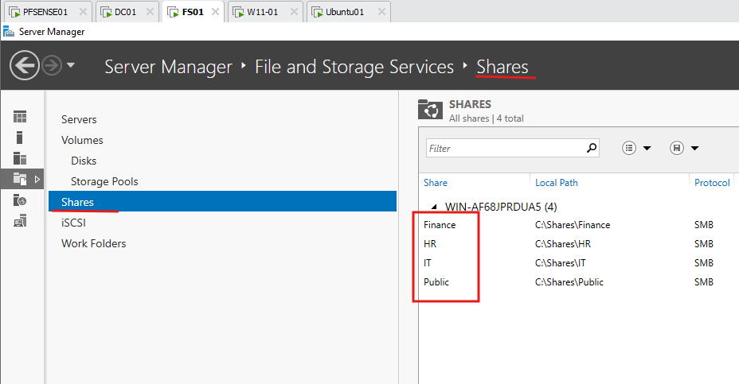

# Day 05 — GPO, services de fichiers et permissions

Configuration de FS01, des partages SMB, des groupes AGDLP, des GPO et de Windows LAPS.

## FS01

| Paramètre | Valeur |
|---|---|
| Nom | FS01 |
| IPv4 | 10.10.20.20 |
| Passerelle | 10.10.20.1 |
| DNS | 10.10.20.10 |
| Domaine | corp.rktlab.test |

Partages :

- \\FS01\Finance
- \\FS01\HR
- \\FS01\IT
- \\FS01\Public

## AGDLP

Account → Global Group → Domain Local Group → Permission.

Exemple Finance : Sarah Tremblay → GG_FINANCE_USERS → DL_FINANCE_RW → \\FS01\Finance.

## GPO

- GPO-Workstations-Security
- GPO-Map-Drives
- GPO-Screen-Lock
- GPO-Account-Lockout
- GPO-Windows-Firewall

Commandes utilisées :

- gpupdate /force
- gpresult /r
- gpresult /h C:\gpresult.html

Le lecteur F: des utilisateurs Finance pointe vers \\FS01\Finance.

## Permissions

Les permissions de partage contrôlent l'accès SMB. Les permissions NTFS contrôlent les dossiers et fichiers.

## Windows LAPS

Windows LAPS configuré sur W11-01.

## Dépannage

Tests faits avec une mauvaise OU, un groupe manquant, des permissions NTFS incorrectes et un lecteur réseau absent.

Voir [Day 05 — Dépannage Active Directory](../troubleshooting/day05-ad-break-fix.md).
