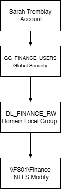

# Day 05 — Active Directory, GPO et services de fichiers

## Objectif

Ajouter un serveur de fichiers, organiser les permissions avec AGDLP, appliquer des GPO et utiliser Windows LAPS.

## FS01

| Paramètre | Valeur |
|---|---|
| Nom | `FS01` |
| Adresse IP | `10.10.20.20` |
| Passerelle | `10.10.20.1` |
| DNS | `10.10.20.10` |
| Domaine | `corp.rktlab.test` |

## Comptes et départements

Des comptes de test sont répartis dans les départements suivants : Finance, HR, IT, Sales et Operations.

Les noms d'objets Active Directory restent en anglais afin de correspondre à la configuration réelle du laboratoire.

## Modèle de permissions AGDLP

Le modèle utilisé est **Account → Global Group → Domain Local Group → Permission**.

Exemple Finance : `Sarah Tremblay` → `GG_FINANCE_USERS` → `DL_FINANCE_RW` → `\\FS01\Finance`.



Les permissions sont attribuées aux groupes plutôt qu'aux utilisateurs directement.

## Services de fichiers

`FS01` héberge notamment les partages SMB suivants :

- `\\FS01\Finance`
- `\\FS01\HR`
- `\\FS01\IT`
- `\\FS01\Public`

### Permissions de partage et NTFS

- les permissions de partage contrôlent l'accès au partage SMB
- les permissions NTFS contrôlent l'accès aux dossiers et fichiers
- les groupes AGDLP simplifient l'administration des accès

## Group Policy

Les GPO suivantes ont été créées dans le laboratoire :

- `GPO-Workstations-Security`
- `GPO-Map-Drives`
- `GPO-Screen-Lock`
- `GPO-Account-Lockout`
- `GPO-Windows-Firewall`

Commandes utilisées pour valider l'application des stratégies :

```cmd
gpupdate /force
gpresult /r
gpresult /h C:\gpresult.html
```

## Mappage de lecteurs

Les utilisateurs Finance reçoivent le lecteur `F:` vers `\\FS01\Finance`.

Le mappage est géré avec Group Policy Preferences et un ciblage par groupe de sécurité.

## Windows LAPS

Windows LAPS a été configuré pour `W11-01`.

L'objectif est d'éviter de réutiliser le même mot de passe administrateur local sur plusieurs postes. Le mot de passe LAPS n'est jamais stocké dans ce dépôt.

## Dépannage

Quatre scénarios ont été reproduits :

1. poste placé dans la mauvaise OU
2. utilisateur retiré de son groupe de sécurité
3. permissions NTFS incorrectes
4. lecteur réseau absent à cause d'un mauvais ciblage GPO

Voir [Day 05 — Dépannage Active Directory](../troubleshooting/day05-ad-break-fix.md).

## Validation

- `FS01` joint au domaine
- partages SMB accessibles selon les permissions prévues
- modèle AGDLP validé
- isolation des accès entre départements vérifiée
- traitement des GPO validé
- mappage de lecteur validé
- Windows LAPS validé
- scénarios de dépannage réalisés

## Ce que j'ai appris

Cette étape m'a permis de mieux comprendre la différence entre OU et groupes, le modèle AGDLP, les permissions de partage et NTFS, le ciblage des GPO et l'intérêt de Windows LAPS.
