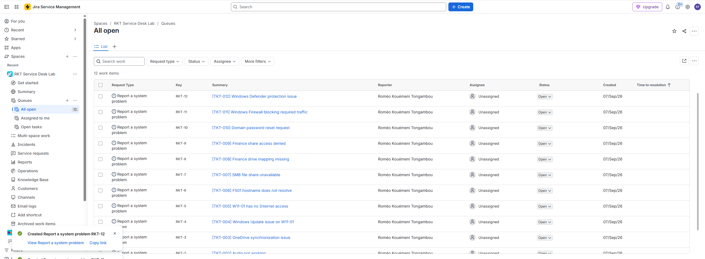
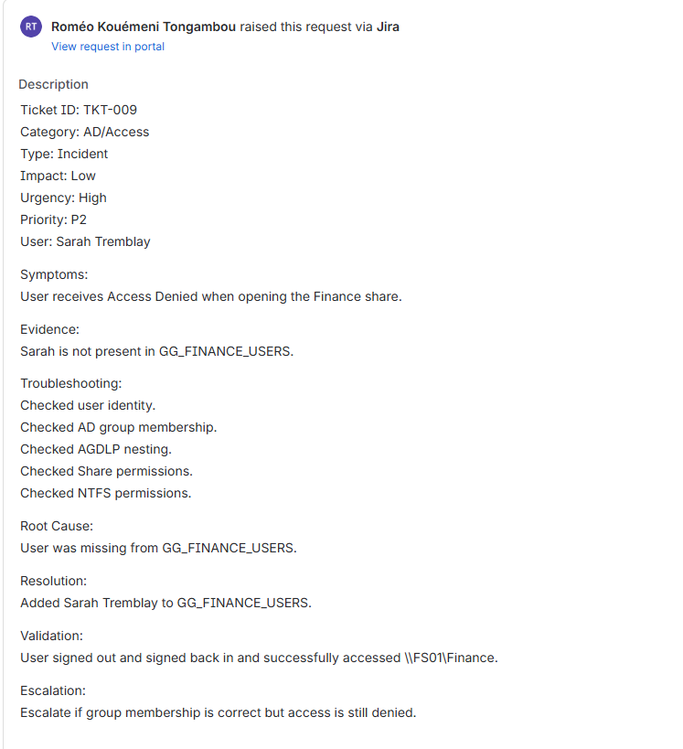

# Day 07 — Poste Windows, Sysinternals et ITSM

## Objectif

Pratiquer le dépannage d'un poste Windows, utiliser les outils Microsoft Sysinternals et documenter des incidents dans Jira Service Management.

## Environnement

| Élément | Valeur |
|---|---|
| Poste | `W11-01` |
| Domaine | `corp.rktlab.test` |
| Contrôleur de domaine | `DC01` |
| Serveur de fichiers | `FS01` |
| Pare-feu | pfSense |
| Service Desk | Jira Service Management |
| Sysinternals | `C:\Tools\Sysinternals` |

## Outils Windows utilisés

Les outils suivants ont été revus ou utilisés selon les scénarios :

- Task Manager
- Services
- Device Manager
- Event Viewer
- Disk Management
- Resource Monitor
- Windows Update
- Windows Defender
- Windows Firewall
- RDP
- lecteurs réseau
- imprimantes
- profils utilisateurs

## Sysinternals

### Process Explorer

Utilisé pour inspecter les processus, PID, processus parents, utilisation CPU/mémoire et compte utilisateur associé.

### Process Monitor

Utilisé pour diagnostiquer un problème de permissions NTFS dans `C:\RKT-Day07\Restricted`.

Le filtre `ACCESS DENIED` a permis d'identifier l'opération bloquée.

Voir [Day 07 — Dépannage avec Process Monitor](../troubleshooting/day07-break-fix.md).

### Autoruns

Utilisé pour vérifier les éléments configurés au démarrage, notamment Logon, Services, Scheduled Tasks et Drivers.

### TCPView

Utilisé pour observer les connexions TCP/UDP actives, les ports locaux et distants ainsi que l'état des connexions.

## ITSM

Les notions suivantes ont été pratiquées : incident, demande de service, problème, changement, impact, urgence, priorité, SLA, escalade, cause racine et validation.

## Jira Service Management

Un projet de laboratoire nommé `RKT Service Desk Lab` a été utilisé pour documenter des scénarios de support.

## Modèle de ticket

Voir [le modèle de ticket](../operations/tickets/TICKET-TEMPLATE.md).

## Base de connaissances

- [KB-001 — Réinitialiser un mot de passe AD](../operations/kb/KB-001-Password-Reset.md)
- [KB-002 — Diagnostiquer un problème d'accès Internet](../operations/kb/KB-002-No-Internet.md)
- [KB-003 — Diagnostiquer une imprimante réseau](../operations/kb/KB-003-Network-Printer.md)

## Méthode de dépannage

La méthode utilisée est simple :

1. identifier le symptôme
2. collecter les informations utiles
3. reproduire le problème
4. faire des tests ciblés
5. trouver la cause
6. appliquer la correction
7. valider le résultat
8. documenter le ticket

## Ce que j'ai appris

Cette étape m'a permis de pratiquer un diagnostic plus structuré sur Windows, d'utiliser Sysinternals pour obtenir des preuves et de mieux documenter les incidents avec une approche de support TI.
