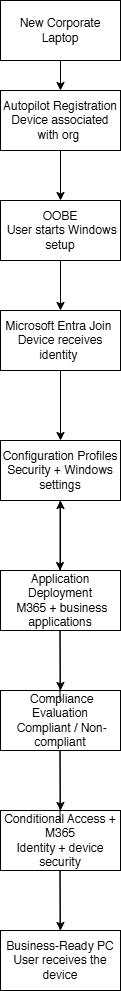

# Day 08 — Entra ID, Intune et Autopilot

Cette étape est différente des précédentes : je n'avais pas de tenant Intune complet pour faire un vrai déploiement. J'ai donc gardé le Day 08 comme étude structurée, sans présenter de configuration cloud que je n'ai pas réalisée.

## Ce que j'ai étudié

### Microsoft Entra ID

Utilisateurs, groupes, rôles, MFA, SSO et contrôle d'accès basé sur les rôles.

J'ai aussi travaillé la différence entre les trois états courants d'un poste :

| État | Cas général |
|---|---|
| Microsoft Entra registered | appareil personnel / BYOD |
| Microsoft Entra joined | poste géré principalement dans le cloud |
| Microsoft Entra hybrid joined | poste lié à AD local et à Entra ID |

### Microsoft Intune

Inscription des appareils, profils de configuration, politiques de conformité, déploiement d'applications, anneaux de mises à jour, actions à distance et synchronisation.

### Windows Autopilot

Le flux que je voulais comprendre est simple : appareil enregistré, profil assigné, premier démarrage, connexion de l'utilisateur, Entra Join, inscription Intune, application des politiques et des applications.

## Dépannage

J'ai préparé un petit runbook pour organiser le diagnostic d'un problème d'inscription, de conformité, d'application ou d'authentification : [Runbook — Dépannage Intune](../operations/intune-troubleshooting-runbook.md).

## Limite assumée

Ce Day ne prouve pas une expérience d'administration Intune en production. Il montre plutôt que je comprends le rôle d'Entra ID, Intune et Autopilot et que je sais les replacer par rapport à l'Active Directory local déjà monté dans le lab.
