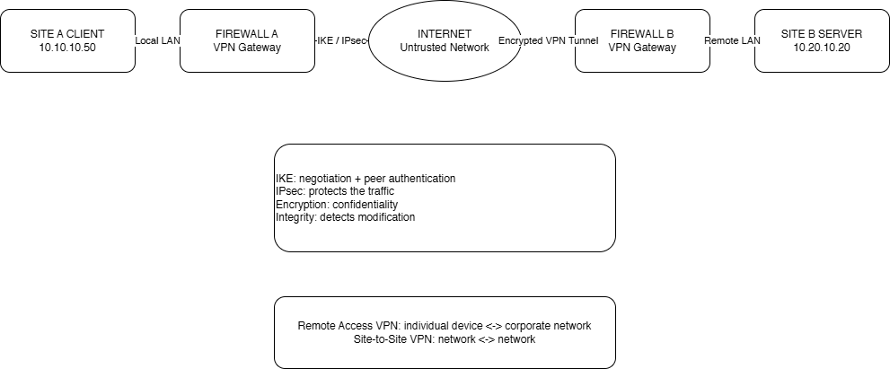

# Day 09 — Fortinet, Linux et VPN

Étude de FortiGate et des VPN IPsec, avec pratique des commandes Linux de base.

## FortiGate et pfSense

| FortiGate | pfSense |
|---|---|
| Firewall Policy | Firewall Rule |
| Service | protocole / port |
| Action | Pass / Block |
| NAT | NAT |
| Session | State |
| Logging | Firewall Logs |

Les concepts étudiés : interfaces, routes, politiques de pare-feu, services, NAT, sessions et journaux.

## Linux

Commandes pratiquées :

- ip a
- ip r
- ping -c 4 adresse_IP
- ss -tulpn
- dig example.com
- curl -I https://example.com
- systemctl status service
- journalctl -p err -b
- ps aux
- df -h
- free -h

## VPN

- Remote Access VPN : un appareil distant rejoint le réseau de l'entreprise.
- Site-to-Site VPN : deux réseaux sont reliés par leurs passerelles VPN.

Pour IPsec : UDP 500 pour IKE, UDP 4500 pour NAT Traversal et protocole IP 50 pour ESP.

Voir [Day 09 — Dépannage VPN](../troubleshooting/day09-vpn-troubleshooting.md).

## Statut

Pratique Linux et étude Fortinet/VPN. Aucun FortiGate de production n'a été administré dans ce lab.