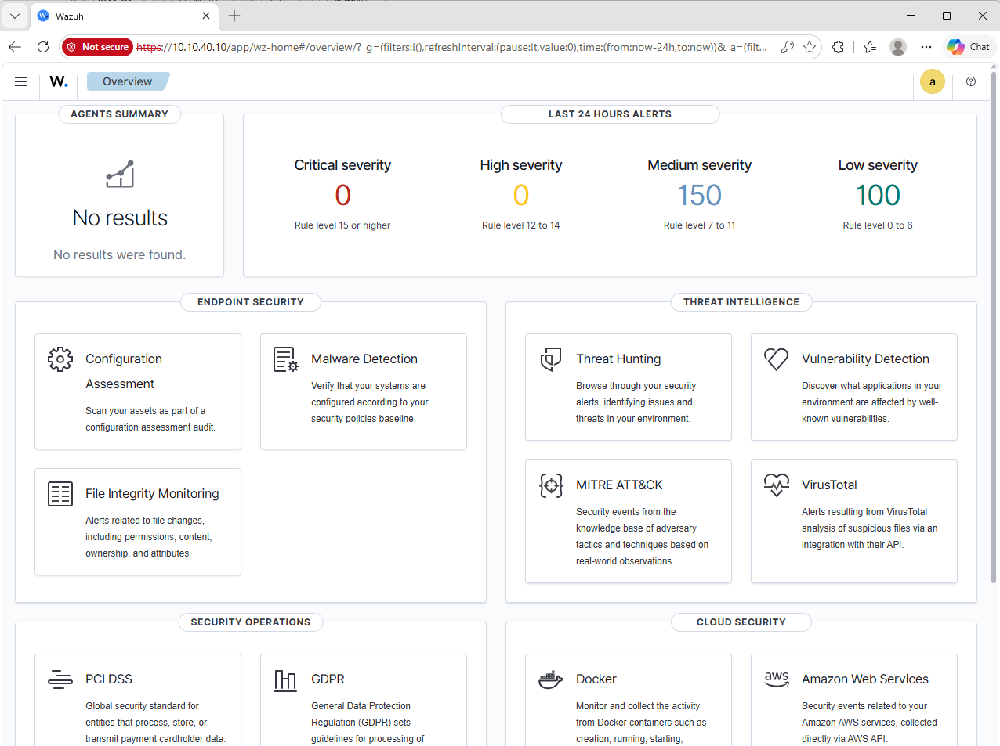

# Day 10 — Wazuh, Sysmon et réponse aux incidents

Wazuh est installé sur WAZUH01. Le dashboard fonctionne. La connexion de W11-01 comme agent n'a pas été terminée.

## WAZUH01

| Élément | Valeur |
|---|---|
| Système | Ubuntu 24.04 LTS |
| Adresse | 10.10.40.10/24 |
| Passerelle | 10.10.40.1 |
| Réseau | SECURITY |
| Wazuh Server / Indexer / Dashboard | installés |
| Dashboard | accessible |

## Problème

W11-01 est sur USERS et WAZUH01 sur SECURITY.

Le test TCP vers 10.10.40.10:1514 échouait. La communication agent-manager n'a pas été validée.

Voir [Dépannage de la connexion Wazuh](../troubleshooting/day10-wazuh-connectivity.md).

## Événements étudiés

| Source | Event ID | Signification |
|---|---:|---|
| Sysmon | 1 | création d'un processus |
| Sysmon | 3 | connexion réseau |
| Sysmon | 11 | création d'un fichier |
| Windows Security | 4624 | ouverture de session réussie |
| Windows Security | 4625 | ouverture de session échouée |
| Windows Security | 4720 | création d'un compte utilisateur |

Je n'ai pas validé la collecte de ces événements dans Wazuh.

## Réponse aux incidents

Méthode utilisée : identifier la machine et le compte, remettre les événements dans l'ordre, vérifier ce qui se passe avant et après, puis noter les actions à prendre.

MITRE ATT&CK vus :

- T1136.001 — Create Account: Local Account
- T1078 — Valid Accounts

Voir [IR-001 — Authentification suspecte](../operations/incidents/IR-001-Suspicious-Authentication.md).

Serveur Wazuh : OK. Agent Windows : à reprendre.
