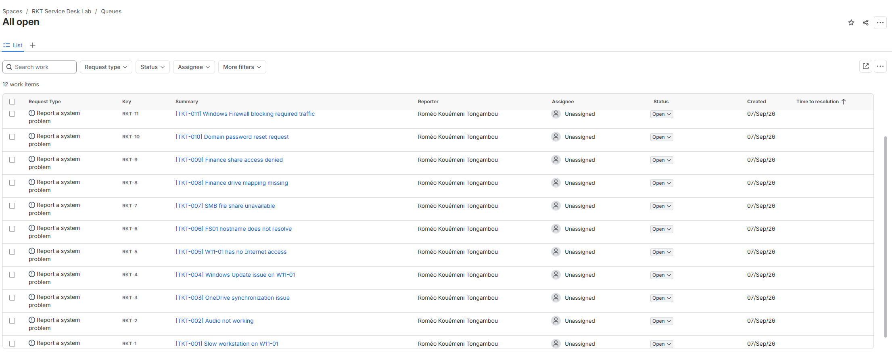

# Day 11 — Opérations TI

12 incidents simulés dans Jira pour pratiquer la priorisation, le dépannage et l'escalade.

## Incidents

| ID | Incident | Catégorie | État |
|---|---|---|---|
| INC-101 | Internet unavailable | Réseau | traité |
| INC-102 | DNS failure | Réseau | traité |
| INC-103 | Firewall block | Réseau | traité |
| INC-104 | Account locked | Active Directory | traité |
| INC-105 | Domain join failure | Active Directory | en attente |
| INC-106 | GPO not applied | Active Directory | en attente |
| INC-107 | Slow workstation | Endpoint | en attente |
| INC-108 | Printer unavailable | Endpoint | en attente |
| INC-109 | Windows service stopped | Endpoint | en attente |
| INC-110 | Finance share denied | Permissions | traité |
| INC-111 | Multiple failed logins | Sécurité | escaladé |
| INC-112 | Wazuh agent disconnected | Sécurité | escaladé |

Priorité basée sur l'impact, l'urgence et le service touché.

Le détail est dans [le journal d'incidents](../operations/tickets/day11-incident-log.md).

## Tickets traités

- INC-101 : carte réseau et passerelle de W11-01
- INC-102 : DNS interne sur DC01
- INC-103 : SMB vers FS01, port TCP 445
- INC-104 : compte AD verrouillé puis déverrouillé
- INC-110 : accès Finance et groupe GG_FINANCE_USERS

## Escalades

- INC-111 : sécurité, pour vérifier les échecs de connexion et le compte concerné
- INC-112 : réseau / sécurité, pour reprendre la connexion W11-01 vers WAZUH01:1514

## Changement

[CHG-001 — Règle Wazuh](../operations/changes/CHG-001-New-Firewall-Rule.md)

## ITGC

[Mini revue ITGC](../operations/audit/ITGC-mini-review.md)
